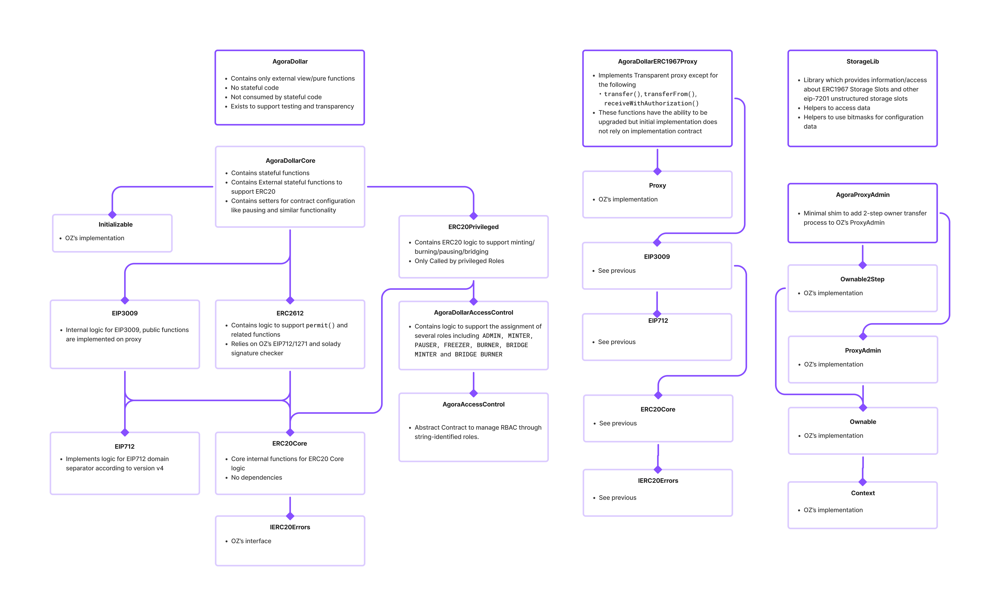
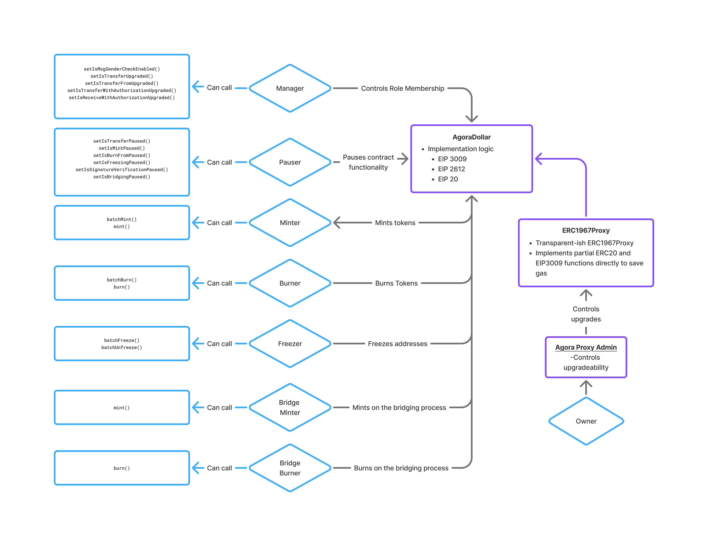

# agora-dollar-evm-tests

## Installation

`npm i`

### For each of the submodules in the `lib` folder you will also need to run `npm i`

```bash
cd lib/agora-standard-solidity
npm i
```
## High level Organization of files

`src/contracts` This directory contains all contracts for deployments

`src/contracts/interfaces` This directory contains all interfaces required to compile

`src/script` This directory contains deployment scripts for AgoraDollar

## Key Contracts and their inheritance



## System Configuration


